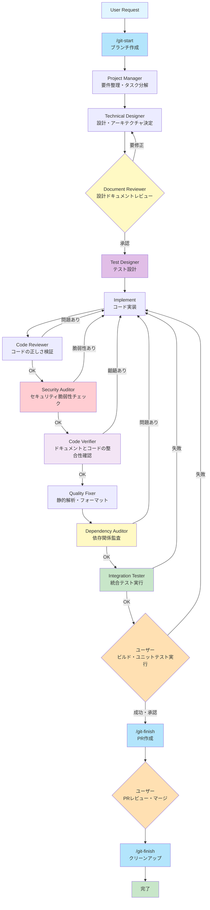

# Claude Code 開発ワークフロー

このドキュメントでは、Claude Codeを使用した開発プロジェクトの標準ワークフローを定義します。

## 目次

- [ワークフロー概要](#ワークフロー概要)
- [フロー図](#フロー図)
- [各ロールの詳細](#各ロールの詳細)
- [フローの特徴](#フローの特徴)
- [使用方法](#使用方法)
- [ベストプラクティス](#ベストプラクティス)
- [トラブルシューティング](#トラブルシューティング)

## ワークフロー概要

このワークフローは、ユーザーからのリクエストを受けてから、コミット可能な状態になるまでの一連のプロセスを定義します。各段階で品質を担保し、設計とコードの整合性を保ちながら開発を進めます。

### 設計思想

- **品質重視**: 各段階でレビューと検証を実施
- **フィードバックループ**: 問題発見時に適切なステップへ戻る
- **自動化**: Integration Testerまでは自動化、最終判断はユーザー
- **整合性保証**: ドキュメントとコードの齟齬を防止
- **多層防御**: セキュリティ、依存関係、統合の各観点で検証

## フロー図



## Gitワークフローエージェント

開発フローの開始と終了を自動化するエージェントです。ワークフローに組み込まれ、自動的に実行されます。

### Git Init（ブランチセットアップ）

**配置:** フローの最初（User Request → **Git Init** → Project Manager）

**責務:**
- mainブランチの最新化
- 新しい開発ブランチの作成

**実行内容:**
1. 現在の状態を確認（未コミット変更の警告）
2. mainブランチに切り替え
3. 最新の変更をプル
4. 新しい開発ブランチを作成

**成果物:**
- 最新のmainから分岐した開発ブランチ

---

### Git Finish（PR作成・クリーンアップ）

**配置:** フローの最後（Integration Tester → ユーザー検証 → **Git Finish**）

**責務:**
- PR作成（PRが存在しない場合）
- クリーンアップ（PRがマージ済みの場合）

**動作モード:**
| 状態 | アクション |
|------|----------|
| PRが存在しない | リモートにプッシュ → PR作成 |
| PRが未マージ | 待機状態を報告 |
| PRがマージ済み | main切替 → pull → ブランチ削除 |

**成果物:**
- 作成されたPR（PR作成時）
- クリーンアップ完了の報告（マージ後）

**典型的なフロー:**
```
1. Integration Tester完了後: Git Finish → PR作成
2. PRをレビュー・マージ（ユーザー手動）
3. マージ後: Git Finish → クリーンアップ
```

---

## スキルコマンド（手動実行用）

エージェントの処理を手動で実行したい場合は、以下のスキルコマンドを使用できます：

| コマンド | 説明 |
|---------|------|
| `/git-start <branch>` | mainから最新を取得し、新しいブランチを作成 |
| `/git-finish` | PR作成またはクリーンアップを自動判定 |

---

## 各ロールの詳細

### 0. Git Init（Gitブランチセットアップ）

**責務:**
- 開発ブランチの作成
- mainブランチの最新化

**実行コマンド:**
```bash
git checkout main
git pull origin main
git checkout -b <branch-name>
```

**次のステップへの条件:**
- 新しい開発ブランチが作成されている
- mainの最新コミットから分岐している

---

### 1. Project Manager（プロジェクトマネージャー）

**責務:**
- ユーザーリクエストの理解と整理
- タスクへの分解
- 優先順位の決定
- 実装スコープの明確化

**成果物:**
- タスクリスト
- 要件定義書
- 受け入れ基準

**次のステップへの条件:**
- 要件が明確に定義されている
- タスクが適切に分解されている

---

### 2. Technical Designer（技術設計者）

**責務:**
- システムアーキテクチャの設計
- 技術選定
- インターフェース設計
- データモデル設計
- 設計ドキュメントの作成

**成果物:**
- 設計ドキュメント
- アーキテクチャ図
- API仕様
- データスキーマ

**次のステップへの条件:**
- Document Reviewerの承認を得る

**フィードバックループ:**
- Document Reviewerから要修正の指摘を受けた場合、設計を見直す

---

### 3. Document Reviewer（ドキュメントレビュアー）

**責務:**
- 設計ドキュメントのレビュー
- 設計の妥当性確認
- 要件との整合性確認
- 実装可能性の検証

**成果物:**
- レビュー結果
- 指摘事項リスト

**判断基準:**
- 設計が要件を満たしているか
- 技術的に実現可能か
- ベストプラクティスに準拠しているか
- ドキュメントが十分に詳細か

---

### 4. Test Designer（テスト設計者）

**配置:** Document Reviewer → **Test Designer** → Implement

**責務:**
- テストケース・テスト戦略の設計
- 境界値・エッジケースの洗い出し
- 受け入れテスト基準の明確化
- テストドキュメントの作成

**成果物:**
- テスト設計書
- ユニットテストケース仕様
- 統合テストケース仕様
- E2Eテストケース仕様

**テストレベル:**
- ユニットテスト: 関数・メソッドレベル
- 統合テスト: モジュール間連携、API、DB
- E2Eテスト: ユーザーシナリオ全体

**次のステップへの条件:**
- すべての要件に対応するテストケースがある
- 正常系、異常系、境界値、エッジケースがカバーされている
- 受け入れ基準が明確

---

### 5. Implement（実装者）

**責務:**
- 設計に基づいたコード実装
- ユニットテストの作成（Test Designerの設計に基づく）
- 統合テストの作成（Test Designerの設計に基づく）
- E2Eテストの作成（Test Designerの設計に基づく）
- コードコメントの記述
- 実装ドキュメントの更新

**成果物:**
- ソースコード
- テストコード（ユニット・統合・E2E）
- 実装メモ

**次のステップへの条件:**
- Code Reviewerの品質基準をクリア
- Security Auditorのセキュリティチェックをクリア
- Code Verifierの整合性チェックをクリア
- Dependency Auditorの依存関係チェックをクリア
- Integration Testerの統合テストをクリア

**フィードバックループ:**
- Code Reviewerから問題指摘を受けた場合、修正
- Security Auditorから脆弱性指摘を受けた場合、修正
- Code Verifierから齟齬指摘を受けた場合、修正
- Dependency Auditorから依存関係の問題指摘を受けた場合、修正
- Integration Testerからテスト失敗報告を受けた場合、修正
- ユーザーのテストで失敗した場合、修正

---

### 6. Code Reviewer（コードレビュアー）

**責務:**
- コードの正しさ検証
- コード品質のチェック
- バグやロジックエラーの検出
- コーディング規約の確認
- 基本的なセキュリティチェック

**チェック項目:**
- ロジックの正確性
- エラーハンドリング
- パフォーマンス
- 可読性
- 保守性

**成果物:**
- レビュー指摘事項
- 修正提案

**判断基準:**
- コードが正しく動作するか
- エッジケースが考慮されているか
- 基本的なセキュリティリスクがないか

---

### 7. Security Auditor（セキュリティ監査者）

**配置:** Code Reviewer → **Security Auditor** → Code Verifier

**責務:**
- OWASP Top 10に基づくセキュリティ脆弱性の専門チェック
- 機密情報のハードコード検出
- 認証・認可ロジックの検証
- セキュリティベストプラクティスの確認

**チェック項目:**
- SQLインジェクション、XSS、CSRF等の脆弱性
- パスワード・APIキー等のハードコード
- 認証バイパスの可能性
- 暗号化の適切性
- ログへの機密情報漏洩

**成果物:**
- セキュリティ監査レポート
- 脆弱性詳細と修正提案

**判断基準:**
- Critical脆弱性: 0件（差し戻し基準）
- High脆弱性: 0件（差し戻し基準）
- Moderate/Low脆弱性: 警告として記録

**フィードバックループ:**
- Critical/High脆弱性が発見された場合、Implementに差し戻し

---

### 8. Code Verifier（コード検証者）

**責務:**
- 設計ドキュメントとコードの整合性確認
- API仕様との一致確認
- データモデルの整合性確認
- インターフェース実装の妥当性確認

**注意:** テストやビルドの実行は行わない

**チェック項目:**
- 設計書通りに実装されているか
- API仕様と実装が一致しているか
- データスキーマが設計通りか
- インターフェースが設計通りか

**成果物:**
- 整合性チェック結果
- 齟齬リスト

**判断基準:**
- ドキュメントとコードに齟齬がない

---

### 9. Quality Fixer（品質修正者）

**責務:**
- 静的解析の実行
- コードフォーマットの適用
- リンターの実行と自動修正
- コードスタイルの統一

**実行内容:**
- ESLint / Prettier（JavaScript/TypeScript）
- Black / isort / Ruff（Python）
- RuboCop（Ruby）
- gofmt（Go）
- その他プロジェクトで使用する静的解析ツール

**成果物:**
- 整形済みコード
- 静的解析レポート

**次のステップへの条件:**
- すべての自動修正が完了

---

### 10. Dependency Auditor（依存関係監査者）

**配置:** Quality Fixer → **Dependency Auditor** → Integration Tester

**責務:**
- 依存パッケージの脆弱性チェック
- ライセンス互換性の確認
- 非推奨パッケージの検出
- 修正提案の作成

**実行内容:**
- npm audit / yarn audit（JavaScript/TypeScript）
- pip-audit / safety（Python）
- bundle audit（Ruby）
- govulncheck（Go）
- cargo audit（Rust）

**チェック項目:**
- CVE脆弱性の存在
- CVSS Scoreに基づく重要度評価
- ライセンスの互換性
- パッケージのメンテナンス状況

**成果物:**
- 依存関係監査レポート
- 脆弱性詳細と修正提案
- ライセンス互換性レポート

**判断基準:**
- Critical脆弱性: 0件（差し戻し基準）
- High脆弱性: 0件（差し戻し基準）
- ライセンス非互換: なし（差し戻し基準）
- Moderate/Low脆弱性: 警告として記録

**フィードバックループ:**
- Critical/High脆弱性、またはライセンス非互換が発見された場合、Implementに差し戻し

---

### 11. Integration Tester（統合テスター）

**配置:** Dependency Auditor → **Integration Tester** → ユーザー検証

**責務:**
- E2Eテスト、API統合テスト、システム統合テストの実行
- テスト環境のセットアップ
- テスト結果の詳細な報告
- 失敗時の再現手順の記録

**実行内容:**
- API統合テスト（Supertest, requests等）
- データベース統合テスト
- E2Eテスト（Playwright, Cypress, Selenium等）
- システム統合テスト

**テスト順序:**
1. API統合テスト（最も基本的）
2. データベース統合テスト
3. システム統合テスト
4. E2Eテスト（最も包括的）

**成果物:**
- 統合テスト結果レポート
- テスト実行ログ
- スクリーンショット（E2E）
- 失敗時の詳細分析

**判断基準:**
- すべてのAPI統合テストがパス
- すべてのデータベース統合テストがパス
- すべてのE2Eテストがパス
- タイムアウトや不安定なテストがない

**フィードバックループ:**
- 1件以上のテストが失敗した場合、Implementに差し戻し

**注意:** ユニットテストは実行しない（ユーザー検証フェーズで実行）

---

### 12. ユーザー（最終検証者）

**責務:**
- ユニットテストの実行
- ビルドの実行
- 動作確認
- 最終承認

**実行内容:**
```bash
# ユニットテスト
npm test
# または
pytest
# または
go test

# ビルド
npm run build
# または
cargo build
# または
go build

# 開発サーバーで動作確認
npm run dev
```

**判断基準:**
- ビルドが成功するか
- すべてのユニットテストがパスするか
- 期待通りの動作をするか
- パフォーマンスが許容範囲か

**アクション:**
- **成功・承認**: Ready to Commitへ進む
- **失敗**: Implementへ戻り、問題を修正

---

## フローの特徴

### ✅ フィードバックループ

#### 1. 設計フェーズ
```
Technical Designer ← Document Reviewer
```
設計に問題がある場合、Technical Designerに戻って再設計

#### 2. 実装フェーズ
```
Implement ← Code Reviewer（品質問題）
Implement ← Security Auditor（セキュリティ脆弱性）
Implement ← Code Verifier（整合性問題）
Implement ← Dependency Auditor（依存関係問題）
Implement ← Integration Tester（統合テスト失敗）
```
各段階で問題が発見された場合、Implementに戻って修正

#### 3. 検証フェーズ
```
Implement ← ユーザー（ユニットテスト失敗時）
```
ユニットテストやビルドが失敗した場合、Implementに戻って修正

### 🎯 ゲートポイント

各フェーズには明確なゲートポイントがあり、基準を満たさない限り次へ進めません：

| ゲート | チェック内容 | 合格基準 |
|--------|------------|---------|
| **設計承認ゲート** | 設計の妥当性 | Document Reviewerの承認 |
| **テスト設計ゲート** | テストケースの完全性 | Test Designerの完了 |
| **コード品質ゲート** | コードの正しさ | Code Reviewerの承認 |
| **セキュリティゲート** | セキュリティ脆弱性 | Security Auditorの承認 |
| **整合性ゲート** | ドキュメントとの整合性 | Code Verifierの承認 |
| **依存関係ゲート** | 依存関係の安全性 | Dependency Auditorの承認 |
| **統合テストゲート** | 統合テスト | Integration Testerの承認 |
| **最終承認ゲート** | ビルド・ユニットテスト | ユーザーの承認 |

### 🤖 自動化 vs 手動

| フェーズ | 自動化レベル |
|---------|------------|
| Project Manager → Integration Tester | **完全自動化** |
| ユーザー検証 | **手動** |
| Ready to Commit | **手動** |

### 🛡️ 多層防御

セキュリティと品質を多層的にチェック：

```
Code Reviewer（基本的なセキュリティ）
    ↓
Security Auditor（専門的なセキュリティ）
    ↓
Dependency Auditor（依存関係のセキュリティ）
    ↓
Integration Tester（実際の動作で検証）
```

## 使用方法

### 基本的な使用フロー

1. **リクエスト提出**
   ```
   ユーザー: 「ログイン機能を実装してください」
   ```

2. **自動実行**
   - Git Init: ブランチ作成
   - Project Manager: 要件を整理し、タスクに分解
   - Technical Designer: 認証方式を選定し、設計を作成
   - Document Reviewer: 設計をレビュー（必要に応じてフィードバック）
   - Test Designer: テストケースを設計
   - Implement: コードとテストを実装
   - Code Reviewer: コードをレビュー（必要に応じてフィードバック）
   - Security Auditor: セキュリティ脆弱性をチェック（必要に応じてフィードバック）
   - Code Verifier: 設計との整合性を確認
   - Quality Fixer: 静的解析とフォーマットを実行
   - Dependency Auditor: 依存関係を監査（必要に応じてフィードバック）
   - Integration Tester: 統合テストを実行（必要に応じてフィードバック）

3. **ユーザー検証**
   ```bash
   # ユニットテスト
   npm test

   # ビルド
   npm run build

   # 動作確認
   npm run dev
   ```

4. **承認またはフィードバック**
   - ✅ 成功: 「承認します」→ Git Finish (PR作成)
   - ❌ 失敗: 問題を報告 → Implementへ戻る

5. **PR作成とマージ**
   - Git Finish: PR自動作成
   - ユーザー: PRをレビュー・マージ
   - Git Finish: クリーンアップ

### Claude Codeでの実装例

```bash
# ワークフローを開始
claude "ログイン機能を実装してください"

# 各エージェントが順次実行される
# - Git Init エージェント
# - Project Manager エージェント
# - Technical Designer エージェント
# - Document Reviewer エージェント
# - Test Designer エージェント
# - Implement エージェント
# - Code Reviewer エージェント
# - Security Auditor エージェント
# - Code Verifier エージェント
# - Quality Fixer エージェント
# - Dependency Auditor エージェント
# - Integration Tester エージェント

# ユーザー検証
npm test && npm run build

# 承認
claude "承認します"
# または問題報告
claude "ユニットテストが失敗します: XXXエラー"
```

## ベストプラクティス

### 1. 明確な要件定義

❌ **悪い例:**
```
「認証機能を追加して」
```

✅ **良い例:**
```
「JWT認証を使用したログイン機能を実装してください。
要件:
- メールアドレスとパスワードでログイン
- トークンの有効期限は24時間
- ログアウト機能も実装
- OWASP Top 10に準拠したセキュリティ対策
- エラーハンドリングを含む」
```

### 2. フィードバックは具体的に

❌ **悪い例:**
```
「なんか動かない」
```

✅ **良い例:**
```
「npm testを実行すると、以下のエラーが発生します:
Error: Cannot find module 'jsonwebtoken'
at login.test.js:5

依存関係のインストールが漏れているようです」
```

### 3. 段階的な実装

大きな機能は分割して実装：
```
1回目: 「ログイン画面のUIを実装」
2回目: 「認証APIエンドポイントを実装」
3回目: 「トークン管理機能を実装」
```

### 4. テストを先に定義

```
「認証機能を実装してください。
テスト要件:
- 正しい認証情報でログイン成功
- 誤った認証情報でログイン失敗
- トークンの期限切れ処理
- ログアウト後の状態確認
- SQLインジェクション対策の確認」
```

## トラブルシューティング

### 問題: 設計レビューで何度も差し戻される

**原因:**
- 要件が不明確
- 技術選定の根拠が不足

**解決策:**
- 要件を詳細に記述
- 制約条件を明示（パフォーマンス、セキュリティなど）
- 既存コードとの統合方法を明確化

---

### 問題: Code Reviewerで頻繁に指摘を受ける

**原因:**
- 設計が不十分
- エッジケースの考慮漏れ
- セキュリティの考慮不足

**解決策:**
- Technical Designer段階で詳細設計
- エラーハンドリングを事前定義
- セキュリティ要件を明確化

---

### 問題: Security Auditorで脆弱性が検出される

**原因:**
- セキュリティベストプラクティスの理解不足
- OWASP Top 10への対策不足

**解決策:**
- Technical Designer段階でセキュリティ設計を明確化
- Security Auditorのレポートを参考に修正
- セキュリティライブラリの適切な使用

---

### 問題: Code Verifierで齟齬が発見される

**原因:**
- 設計ドキュメントの読み間違い
- 仕様変更が反映されていない
- インターフェースの理解不足

**解決策:**
- 設計ドキュメントを再確認
- Technical Designerで仕様を明確化
- APIスキーマを明示的に定義

---

### 問題: Dependency Auditorで脆弱性が検出される

**原因:**
- 古い依存パッケージの使用
- 脆弱性のあるバージョンの使用

**解決策:**
- `npm audit fix` 等で依存関係を更新
- 代替パッケージの検討
- セキュリティアドバイザリの定期確認

---

### 問題: Integration Testerでテストが失敗する

**原因:**
- 統合テストコードのバグ
- 実装のバグ
- テスト環境の問題

**解決策:**
- テスト失敗のログを詳細に確認
- ローカル環境でテストを再現
- テストデータやモックの確認

---

### 問題: ユーザーテストで失敗する

**原因:**
- テストの実行方法が不適切
- 環境依存の問題
- 依存関係の不足

**解決策:**
```bash
# 依存関係の再インストール
npm ci
# または
pip install -r requirements.txt

# クリーンビルド
npm run clean && npm run build

# 環境変数の確認
cat .env.example
```

---

### 問題: Quality Fixerでエラーが発生

**原因:**
- 静的解析ツールの設定問題
- コードが自動修正できない構文エラー

**解決策:**
- 静的解析ツールの設定を確認（.eslintrc, .prettierrcなど）
- Implementに戻って構文エラーを修正

---

## フロー改善のフィードバック

このワークフローは継続的に改善されるべきものです。以下の場合は、フローの見直しを検討してください：

- 特定のフェーズで頻繁に問題が発生する
- フィードバックループが多すぎて非効率
- 新しい開発手法やツールの導入
- プロジェクト固有の要件

改善提案がある場合は、このドキュメントを更新してください。

---

## 関連ドキュメント

- [README.md](./README.md): プロジェクト概要
- [CLAUDE.md](./CLAUDE.md): グローバル設定
- [settings.json](./settings.json): Claude Code設定
- [agents/](./agents/): エージェント定義
- [hooks/](./hooks/): フック設定
- [skills/](./skills/): スキル定義

---

## バージョン履歴

- **v2.0.0** (2026-02-03): 4つの新規エージェント追加
  - Security Auditor: セキュリティ専門監査
  - Test Designer: テスト設計の専門化
  - Dependency Auditor: 依存関係監査
  - Integration Tester: 統合テスト自動実行
  - フロー図の更新
  - 各エージェントの詳細説明追加

- **v1.0.0** (2026-02-02): 初版作成
  - 基本ワークフローの定義
  - 8つのロール（Project Manager → Ready to Commit）の定義
  - フィードバックループの明確化
